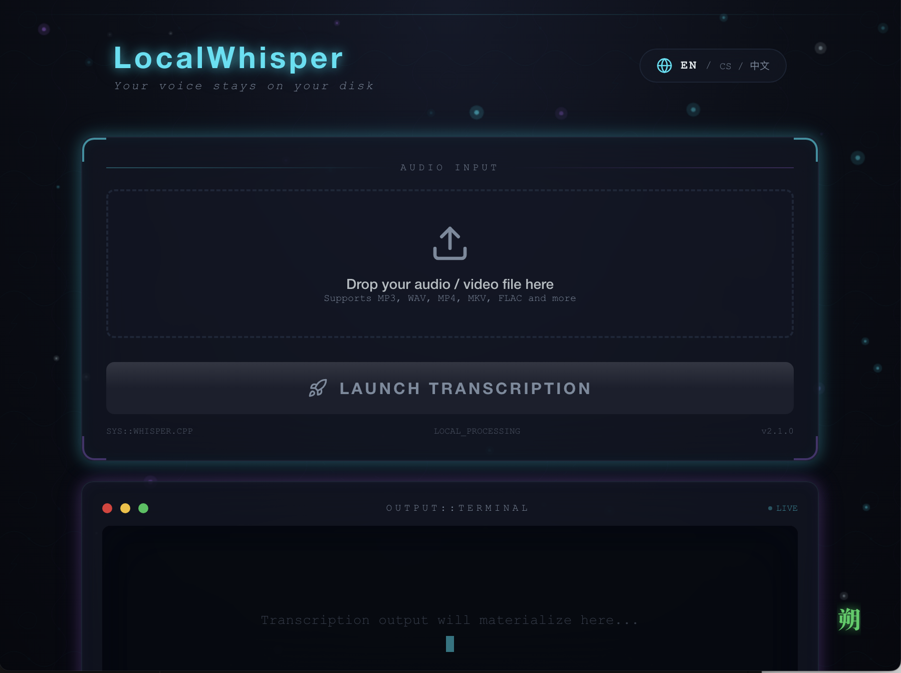

# LocalWhisper 🎙️

[English](#english) | [中文](#chinese)

---

## 🏮 中文说明

**LocalWhisper** 是一款基于 OpenAI Whisper 模型的桌面端语音转文字工具。它专注于 **100% 离线隐私安全** 以及 **极致的跨平台兼容性**。

### ✨ 核心特性
* **🔒 隐私至上**：所有计算均在本地完成，音频文件绝不上传云端，甚至无需联网。
* **🚀 开箱即用**：内置静态编译的 `whisper.cpp` 引擎和 `FFmpeg`，无需手动配置复杂的环境变量。
* **🛠️ 深度优化**：针对不同硬件架构进行了底层优化：
    * **macOS**: 支持 Apple Silicon 原生加速；针对 Intel Mac 优化了指令集调用，解决老旧设备闪退问题。
    * **Windows**: 采用完全静态编译，彻底解决缺失 `vcruntime140.dll` 等运行库问题。
* **🌍 多语言支持**：支持全球数十种语言的转录与自动检测。

### ⚙️ 技术实现 (Engineering Highlights)
本项目不仅是 Electron 套壳，在开发过程中解决了一系列工程化难题：
1.  **静态链接优化**：通过 CMake `BUILD_SHARED_LIBS=OFF` 配置，解决了 macOS 下常见的 `dyld: Library not loaded` 报错。
2.  **指令集兼容性**：在编译阶段针对 Intel 架构禁用了 AVX/F16C 等指令集，确保软件在 2015 年之前的旧款 Mac/PC 上依然稳定。
3.  **自动化流水线**：利用 GitHub Actions 实现跨平台自动构建，并集成 Ad-hoc 代码签名，优化了用户在安装时的安全校验体验。

### 🚀 快速开始
1.  前往 [官网主页](https://github.com/ZHANGSHUO22/LocalWhisper_Project) 或 [Releases](https://github.com/ZHANGSHUO22/LocalWhisper_Project/releases) 下载安装包。
2.  安装并运行，选择音频文件即可开始转录。

---

## 🌐 English

**LocalWhisper** is a high-performance desktop application for speech-to-text, powered by OpenAI's Whisper model. It is designed for **100% offline privacy** and **seamless cross-platform compatibility**.

### ✨ Features
* **🔒 Privacy Centric**: All processing happens on your local machine. No data ever leaves your device.
* **🚀 Zero Configuration**: Built-in statically compiled `whisper.cpp` engine and `FFmpeg`. Download and run instantly.
* **🛠️ Optimized Performance**:
    * **macOS**: Native acceleration for Apple Silicon; Optimized for legacy Intel Macs by addressing incompatible instruction sets.
    * **Windows**: Statically linked binaries to prevent "Missing DLL" errors.
* **🌍 Multilingual**: Supports transcription and auto-detection for 50+ languages.

### ⚙️ Technical Highlights
* **Static Compilation**: Solved dynamic library dependency issues (`dyld` errors) on macOS through expert-level CMake configuration.
* **Legacy Hardware Support**: Custom build flags to ensure compatibility with older Intel CPUs by disabling modern AVX instructions.
* **Automated CI/CD**: Fully automated multi-platform build pipeline using GitHub Actions with integrated asset management.

### 📦 Installation
Download the latest version for your OS from the [Releases](https://github.com/ZHANGSHUO22/LocalWhisper_Project/releases) page.

  

---

## 👨‍💻 About Developer (Hiring)

I am **Shuo Zhang**, a developer passionate about building privacy-focused AI tools and solving low-level engineering challenges.

**I am currently looking for new opportunities!**
If you are looking for a developer who can bridge the gap between high-level UI (Electron/Node.js) and low-level performance (C++/Compilation), let's connect!

* **LinkedIn**: [Shuo Zhang](https://www.linkedin.com/in/shuo-zhang-295888237)
* **Project Site**: [LocalWhisper Landing Page](https://github.com/ZHANGSHUO22/LocalWhisper_Project)

---

## 📄 License
This project is licensed under the MIT License. See the [legal/LICENSE_THIRD_PARTY.txt](legal/LICENSE_THIRD_PARTY.txt) file for full license text and third-party notices.
